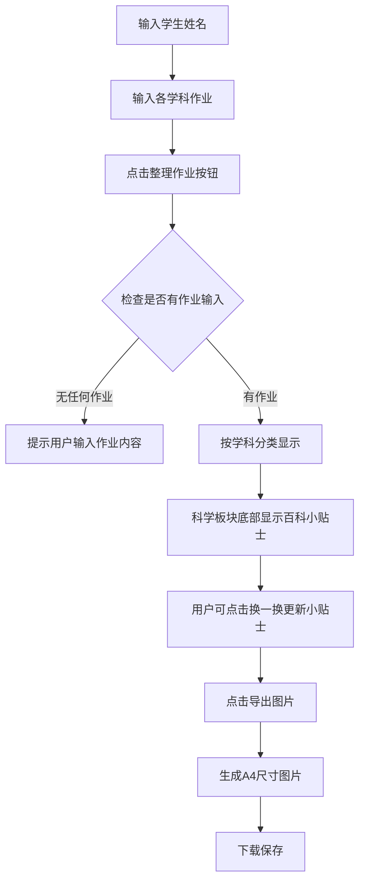

# 学生作业整理助手 - 产品需求文档

## 1. 产品概述

一款帮助小学生整理每日学科作业的网页应用，家长或学生可快速输入各科作业内容，自动分类整理并导出为精美的图片，方便打印后携带使用。

- **核心价值**：告别手抄烦恼，一键生成规范的作业清单
- **目标用户**：小学生家长、需要整理作业的学生
- **使用场景**：每日作业整理、打印备忘、作业清单分享

## 2. 核心功能

### 2.1 功能模块

1. **学生信息输入区**
   - 学生姓名输入框（必填）
   - 用于在输出结果中显示，如"作业小助手 • 今日作业 • 刘静嘉"

2. **学科作业输入区**（5个固定学科模块，均为可选项）
   - 语文、数学、英语、科学、其他
   - 输入格式：数字列表排列，分号隔开
   - 示例：`1. 完成练习册第23页；2. 背诵古诗《静夜思》`

3. **作业清单输出区**
   - 按学科分类显示，每个学科一个独立板块
   - 板块排列顺序：语文 → 英语 → 数学 → 科学 → 其他
   - 每项作业后显示空白复选框
   - 作业间距紧凑显示
   - 标题格式："作业小助手 • 今日作业 • [学生姓名]"

4. **小学生百科小贴士**
   - 仅在科学板块底部显示
   - 每次显示3条内容（好习惯、好性格、高效完成任务等方面）
   - "换一换"按钮可随机更新内容

5. **导出功能**
   - 一键将整理后的作业清单导出为图片
   - 针对A4纸打印优化（调整行距和布局）

## 3. 用户流程

### 3.1 主要流程

```
用户输入学生姓名 → 输入各学科作业（可选）→ 点击"整理作业"按钮
↓
系统按学科分类显示作业清单 → 科学板块显示小学生百科小贴士
↓
点击"导出图片"按钮 → 生成A4尺寸图片 → 保存/下载
```

### 3.2 流程图



## 4. 界面设计

### 4.1 设计风格

- **整体风格**：清新简约、教育友好、童趣但不失专业
- **配色方案**：
  - 主色调：柔和蓝 `#4A90D9`（信任、专注）
  - 辅助色：温暖橙 `#FF8C42`（活力、友好）
  - 背景色：浅灰白 `#F8F9FA`
  - 文字色：深灰 `#333333`
  - 学科标签色：语文-红色、英语-蓝色、数学-绿色、科学-紫色、其他-灰色
- **字体**：
  - 标题：思源黑体或圆润的无衬线字体
  - 正文：清晰易读的字体
- **布局**：单页面应用，垂直滚动，上下分区

### 4.2 页面布局

| 区域 | 内容 | 说明 |
|------|------|------|
| 顶部 | 应用标题 | "作业小助手" |
| 输入区 | 学生姓名 + 5个学科输入框 + 整理按钮 | 左侧布局或卡片式 |
| 输出区 | 分类作业清单 + 百科小贴士 + 导出按钮 | 仅在点击整理后显示 |
| 底部 | 版权信息 | 可选 |

### 4.3 响应式设计

- 桌面端优先设计
- 平板和手机端自适应布局
- 输入区域采用卡片式设计，方便操作

## 5. 交互细节

### 5.1 输入验证

- 学生姓名：必填，未输入时提示
- 学科作业：均为可选项，不输入则该学科板块不显示
- 输入格式：支持"1. xxx；2. xxx"或直接"xxx；xxx"格式

### 5.2 输出显示

- 未整理时，输出区域隐藏
- 整理后，依次显示各学科板块（按固定顺序）
- 空白复选框使用`☐`符号
- 作业项间距：紧凑（约0.8em）

### 5.3 小贴士功能

- 预置20+条小贴士内容
- 每次随机抽取3条不重复显示
- 点击"换一换"重新随机抽取3条

### 5.4 导出功能

- 使用 html2canvas 库生成图片
- 输出尺寸：A4竖版比例（210mm × 297mm）
- 分辨率：适合打印的清晰度
- 自动触发下载，文件名包含学生姓名和日期

## 6. 技术约束

- 纯前端实现，无需后端服务器
- 使用 HTML + CSS + JavaScript
- 使用 html2canvas 库实现图片导出
- 所有功能在浏览器本地完成，保护用户隐私
