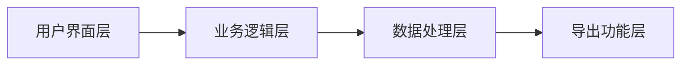

# 学生作业整理助手 - 技术架构文档

## 1. 架构设计



**层次说明：**
- **用户界面层**：HTML结构 + CSS样式 + 用户交互
- **业务逻辑层**：JavaScript处理输入解析、分类、显示逻辑
- **数据处理层**：小贴士数据管理、随机抽取算法
- **导出功能层**：html2canvas 生成图片

## 2. 技术选型

- **前端框架**：原生 HTML5 + CSS3 + JavaScript（ES6+）
- **图片导出**：html2canvas（CDN引入）
- **构建工具**：无需，使用单文件 HTML 直接运行
- **后端**：无，纯前端实现

## 3. 页面结构

| 路由 | 用途 |
|------|------|
| `/index.html` | 单页面应用，包含所有功能 |

## 4. 核心模块设计

### 4.1 输入处理模块

```javascript
// 输入格式解析
// 支持格式：
// 1. 完成练习册第23页；2. 背诵古诗
// 1. xxx; 2. xxx
// xxx; xxx
function parseHomeworkInput(input) {
  // 解析分号分隔的内容
  // 去除数字序号
  // 返回数组
}
```

### 4.2 学科分类模块

```javascript
const SUBJECTS = ['语文', '英语', '数学', '科学', '其他'];

// 按固定顺序显示已填写的学科作业
function displayHomeworkBySubject(subjectData) {
  // 遍历 SUBJECTS 数组
  // 只显示有内容的学科
  // 按固定顺序排列
}
```

### 4.3 小贴士模块

```javascript
const TIPS = [
  { category: '好习惯', text: '...' },
  { category: '好性格', text: '...' },
  { category: '高效', text: '...' }
];

function getRandomTips(count = 3) {
  // 随机抽取不重复的小贴士
  // 返回指定数量
}
```

### 4.4 导出模块

```javascript
async function exportToImage() {
  // 1. 获取导出区域 DOM
  // 2. 使用 html2canvas 转换为图片
  // 3. 触发下载
  // 4. 文件名格式：学生姓名_作业清单_日期.png
}
```

## 5. 数据结构

### 5.1 用户输入数据

```javascript
{
  studentName: string,           // 学生姓名（必填）
  subjects: {
    语文: string[],              // 语文作业数组
    英语: string[],
    数学: string[],
    科学: string[],
    其他: string[]
  }
}
```

### 5.2 小贴士数据

```javascript
{
  category: '好习惯' | '好性格' | '高效完成任务',
  text: string
}
```

## 6. 文件结构

```
/Users/mixian/homework/
├── index.html          # 主页面（包含 HTML、CSS、JS）
└── .trae/
    └── documents/
        ├── PRD.md      # 产品需求文档
        └── README.md   # 技术架构文档
```

## 7. 兼容性考虑

- 目标浏览器：Chrome、Firefox、Safari、Edge（最新版）
- 移动端：iOS Safari、Android Chrome
- 无需兼容 IE 浏览器

## 8. 性能目标

- 首屏加载：< 1秒
- 作业整理响应：< 100ms
- 图片导出：< 2秒
